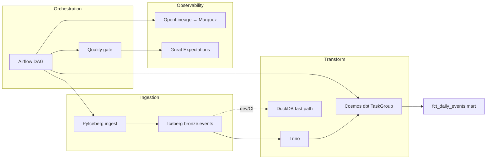

# lakehouse-platform-starter

[](https://github.com/br413/lakehouse-platform-starter/actions/workflows/ci.yml)
[](https://github.com/br413/lakehouse-platform-starter/actions/workflows/docs.yml)

Production-grade reference architecture for a modern data platform:

**Airflow + Cosmos** (orchestrate) → **dbt** (transform) → **Iceberg** (storage) → **OpenLineage** (lineage) → **Great Expectations** (quality)

Built to demonstrate senior data engineering patterns: thin orchestration, observable pipelines, incremental marts, and backfill-safe design.

## Implementation status

| Component | Status | Notes |
|-----------|--------|-------|
| dbt transform (staging → int → marts) | **Implemented** | Tests, docs site, incremental mart |
| Local pipeline (ingest → dbt → GE) | **Implemented** | `make pipeline` or `scripts/pipeline.ps1` |
| Iceberg REST + MinIO | **Implemented** | Docker Compose; PyIceberg ingest |
| dbt-trino on Iceberg | **Implemented** | Native lakehouse path via Trino `:8090` |
| Airflow + Cosmos DbtTaskGroup | **Implemented** | Per-model tasks; `DBT_TARGET=iceberg` in Docker |
| OpenLineage + Marquez | **Implemented** | Docker Compose |
| Great Expectations gate | **Implemented** | Blocks publish on mart validation failure |
| CI + GitHub Pages dbt docs | **Implemented** | [dbt docs site](https://br413.github.io/lakehouse-platform-starter/) |
| Terraform (S3 + IAM) | **Implemented** | Minimal bronze bucket module |
| Meltano ingestion | Planned | Python/PyIceberg ingest simulates bronze |
| Interview walkthrough | **Implemented** | [docs/interview-walkthrough.md](./docs/interview-walkthrough.md) |
| OpenTelemetry traces | Planned | Lineage via Marquez only |
| Helm / K8s deploy | Planned | See `infra/terraform/` |

## Architecture



## Design principles

1. **Thin orchestration** — Airflow schedules and observes; dbt owns transform logic.
2. **OpenLineage as contract** — every task emits lineage; dbt Cloud jobs are first-class RUN parents.
3. **Backfill safety** — idempotent DAGs, partition keys, incremental marts, documented runbooks.

See [ARCHITECTURE.md](./ARCHITECTURE.md), [docs/interview-walkthrough.md](./docs/interview-walkthrough.md), and [docs/decisions/](./docs/decisions/).

## Quick start (local)

### One-command pipeline (no Docker)

```powershell
# Windows
pip install -r requirements.txt
.\scripts\pipeline.ps1
```

```bash
# Linux / macOS
pip install -r requirements.txt
make pipeline
```

Uses DuckDB for speed. Runs: bronze ingest → dbt seed/build → Great Expectations → populated mart.

### Full stack (Iceberg + Airflow + Marquez)

```bash
docker compose up -d
# MinIO console:  http://localhost:9001  (admin / password)
# Iceberg REST:   http://localhost:8181
# Airflow UI:     http://localhost:8080  (admin / admin)
# Marquez UI:     http://localhost:5000
# Trigger DAG:   lakehouse_daily
```

Docker mode uses **`DBT_TARGET=iceberg`**: PyIceberg → Iceberg bronze → **Trino** → dbt-trino → Iceberg marts. No DuckDB bridge.

```bash
docker compose up -d
# MinIO console:  http://localhost:9001  (admin / password)
# Iceberg REST:   http://localhost:8181
# Trino:          http://localhost:8090
# Airflow UI:     http://localhost:8080  (admin / admin)
# Marquez UI:     http://localhost:5000
# Trigger DAG:   lakehouse_daily
```

Native Iceberg pipeline (with Docker stack running):

```powershell
.\scripts\pipeline-iceberg.ps1
# or: make pipeline-iceberg
```

### Interview prep

See **[docs/interview-walkthrough.md](./docs/interview-walkthrough.md)** — 30-second pitch, demo script, common questions, and trade-offs.

### dbt docs

Hosted at **https://br413.github.io/lakehouse-platform-starter/** (auto-deployed on push to `main`).

Local:

```bash
make docs
cd transform/dbt && dbt docs serve
```

## What this demonstrates (senior DE)

- **Medallion architecture** — bronze → staging → intermediate → marts
- **Open table format** — Iceberg REST catalog + MinIO object storage
- **Incremental models** — `delete+insert` on partition keys for backfill-safe reloads
- **Data contracts** — schema tests, singular tests, GE publish gate
- **Thin orchestration** — Cosmos DbtTaskGroup; SQL lives in dbt
- **IaC literacy** — Terraform module for bronze S3 + pipeline IAM
- **CI/CD** — `dbt build`, smoke test, DAG parse, `terraform validate`, docs deploy
- **OSS contributions** — upstream Airflow OpenLineage PR (see below)

## OSS contributions (Airflow lane)

| Item | Link | Status |
|------|------|--------|
| Flagship issue | [apache/airflow#68661](https://github.com/apache/airflow/issues/68661) | RUN-level OpenLineage for dbt Cloud jobs |
| **Open PR** | [**apache/airflow#70185**](https://github.com/apache/airflow/pull/70185) | Attach dbt Cloud job metadata to OL events |
| Quick win | [#47160](https://github.com/apache/airflow/issues/47160) | Python 3.12 fork() DeprecationWarning fix |

See [oss/AIRFLOW_CONTRIBUTIONS.md](./oss/AIRFLOW_CONTRIBUTIONS.md) for full playbook.

## Repo layout

```
infra/          Terraform (S3 bronze bucket + IAM)
orchestration/  Airflow DAGs + Cosmos + OpenLineage
transform/      dbt project (staging → int → marts)
storage/        Iceberg catalog config + DuckDB warehouse
quality/        Great Expectations checkpoint
ingestion/      DuckDB + PyIceberg bronze ingest
tests/          End-to-end pipeline smoke test
docs/           ADRs + runbooks
```
