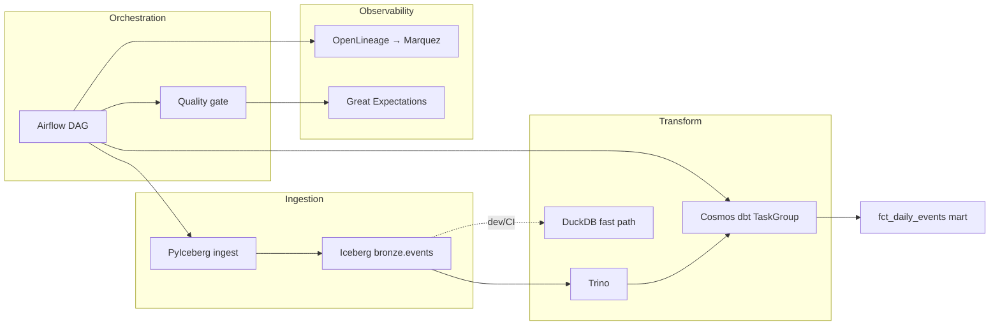

<div align="center">

# lakehouse-platform-starter

**Production-grade lakehouse reference architecture — runnable, tested, and interview-ready**

[](https://github.com/br413/lakehouse-platform-starter/actions/workflows/ci.yml)
[](https://github.com/br413/lakehouse-platform-starter/actions/workflows/docs.yml)
[](LICENSE)
[](https://www.python.org/)
[](https://www.getdbt.com/)
[](https://airflow.apache.org/)
[](https://iceberg.apache.org/)
[](https://trino.io/)
[](https://www.terraform.io/)

[**Live dbt docs**](https://br413.github.io/lakehouse-platform-starter/) · [**Quick start**](docs/QUICKSTART.md) · [**Interview walkthrough**](docs/interview-walkthrough.md) · [**Portfolio**](https://br413.github.io/)


</div>

---

**Try it in ~30 seconds** (no Docker):

```bash
git clone https://github.com/br413/lakehouse-platform-starter.git
cd lakehouse-platform-starter
pip install -r requirements.txt && make pipeline   # Windows: .\scripts\demo.ps1
```

Success = dbt tests green + Great Expectations pass + rows in `fct_daily_events`.

**Airflow + Cosmos** → **dbt** → **Iceberg** → **OpenLineage** → **Great Expectations**

Thin orchestration, observable pipelines, incremental marts, and backfill-safe design — built to demonstrate senior data engineering execution, not slide-deck architecture.

## Table of contents

- [Highlights](#highlights)
- [Architecture](#architecture)
- [Quick start](#quick-start)
- [Implementation status](#implementation-status)
- [OSS contributions](#oss-contributions)
- [Repo layout](#repo-layout)
- [Documentation](#documentation)

## Highlights

| | |
|---|---|
| **Two runnable paths** | DuckDB for fast CI/local · Trino + Iceberg for credible lakehouse demo |
| **Cosmos orchestration** | Per-model Airflow tasks with virtualenv isolation |
| **14 dbt tests** | Schema, singular, and incremental mart with partition keys |
| **Quality gate** | Great Expectations blocks publish on mart validation failure |
| **Full local stack** | MinIO · Iceberg REST · Trino · Airflow · Marquez in Docker Compose |
| **IaC + CI** | Terraform bronze module · GitHub Actions · hosted dbt docs |

## Architecture



### Design principles

1. **Thin orchestration** — Airflow schedules and observes; dbt owns transform logic.
2. **OpenLineage as contract** — every task emits lineage; dbt Cloud jobs are first-class RUN parents.
3. **Backfill safety** — idempotent DAGs, partition keys, incremental marts, documented runbooks.

See [ARCHITECTURE.md](./ARCHITECTURE.md) and [docs/decisions/](./docs/decisions/).

## Quick start

One-page guide: **[docs/QUICKSTART.md](./docs/QUICKSTART.md)**.

| Path | Command | Time |
|------|---------|------|
| Fast (no Docker) | `make pipeline` · Windows: `.\scripts\demo.ps1` | ~30–60s |
| Full lakehouse | `docker compose up -d` → trigger `lakehouse_daily` | ~2 min |
| Iceberg CLI | `make pipeline-iceberg` (stack must be up) | ~1 min |
| Smoke test | `make test` · Windows: `python -m unittest tests.test_pipeline -v` | ~30s |

Environment variables (`DBT_TARGET`, `DUCKDB_PATH`, etc.) are documented in [ARCHITECTURE.md](./ARCHITECTURE.md#environment-variables).

### Fast path — no Docker (~30–60 seconds)

```bash
pip install -r requirements.txt
make pipeline          # macOS / Linux
# Windows:
.\scripts\demo.ps1
```

What runs: bronze ingest → dbt seed/build → Great Expectations → `fct_daily_events` mart.

**You should see:**

```text
Pipeline complete.   # or: Demo OK
MART_ROWS=<n>        # demo.ps1 prints sample mart rows
```

Then open `storage/warehouse/dev.duckdb` (or re-run `make test`) to confirm the mart is non-empty.

### Full lakehouse stack — Docker

```bash
docker compose up -d
```

| Service | URL | Credentials |
|---------|-----|-------------|
| Airflow | http://localhost:8080 | admin / admin |
| Marquez (lineage) | http://localhost:5000 | — |
| Trino | http://localhost:8090 | — |
| MinIO console | http://localhost:9001 | admin / password |
| Iceberg REST | http://localhost:8181 | — |

Trigger DAG **`lakehouse_daily`** — uses `DBT_TARGET=iceberg` (PyIceberg → Trino → dbt-trino → Iceberg marts).

```bash
make pipeline-iceberg
```

### Makefile targets

Run `make help` for the full list. Common targets:

| Target | Description |
|--------|-------------|
| `pipeline` | DuckDB path: ingest → dbt → GE |
| `pipeline-iceberg` | Trino/Iceberg path (Docker required) |
| `test` | End-to-end smoke test |
| `docs` | Generate local dbt docs |
| `lint` | dbt compile/parse + DAG syntax check |
| `up` / `down` | Start/stop Docker stack |

### Interview prep

Rehearse from **[docs/interview-walkthrough.md](./docs/interview-walkthrough.md)** — 30-second pitch, demo script, Q&A, and trade-offs.

## Implementation status

| Component | Status | Notes |
|-----------|--------|-------|
| dbt transform (staging → int → marts) | ✅ | Tests, docs site, incremental mart |
| Local pipeline (ingest → dbt → GE) | ✅ | `make pipeline` |
| Iceberg REST + MinIO | ✅ | Docker Compose; PyIceberg ingest |
| dbt-trino on Iceberg | ✅ | Native path via Trino `:8090` |
| Airflow + Cosmos DbtTaskGroup | ✅ | Per-model tasks; virtualenv execution |
| OpenLineage + Marquez | ✅ | Docker Compose |
| Great Expectations gate | ✅ | Blocks publish on failure |
| CI + GitHub Pages dbt docs | ✅ | [Hosted docs](https://br413.github.io/lakehouse-platform-starter/) |
| Terraform (S3 + IAM) | ✅ | Bronze bucket module |
| Interview walkthrough | ✅ | [docs/interview-walkthrough.md](./docs/interview-walkthrough.md) |
| Meltano ingestion | 🔜 | PyIceberg simulates bronze today |
| OpenTelemetry traces | 🔜 | Lineage via Marquez only |
| Helm / K8s deploy | 🔜 | See `infra/terraform/` |

## OSS contributions

| Item | Link | Status |
|------|------|--------|
| **Open PR** | [Airflow #70171](https://github.com/apache/airflow/pull/70171) | Surface dbt Cloud failure details in task logs (CI green) |
| Merged | [Airflow #71158](https://github.com/apache/airflow/pull/71158) | Clarify metrics vs traces `otel_*` options |
| Related issue | [apache/airflow#68661](https://github.com/apache/airflow/issues/68661) | RUN-level OpenLineage for dbt Cloud |

Playbook: [oss/AIRFLOW_CONTRIBUTIONS.md](./oss/AIRFLOW_CONTRIBUTIONS.md)

## Repo layout

```
infra/          Terraform (S3 bronze bucket + IAM)
orchestration/  Airflow DAGs + Cosmos + OpenLineage
transform/      dbt project (staging → int → marts)
storage/        Iceberg catalog + Trino config + DuckDB warehouse
quality/        Great Expectations checkpoint
ingestion/      DuckDB + PyIceberg bronze ingest
tests/          End-to-end pipeline smoke test
docs/           ADRs, runbooks, interview walkthrough
```

## Documentation

| Doc | Purpose |
|-----|---------|
| [docs/QUICKSTART.md](./docs/QUICKSTART.md) | Clone → first successful pipeline |
| [CONTRIBUTING.md](./CONTRIBUTING.md) | Dev setup, PR guidelines |
| [ARCHITECTURE.md](./ARCHITECTURE.md) | Stack, data flow, env vars |
| [docs/interview-walkthrough.md](./docs/interview-walkthrough.md) | Interview demo script + Q&A |
| [docs/decisions/](./docs/decisions/) | ADRs (Iceberg, thin orchestration, OpenLineage) |
| [docs/runbooks/backfill-safety.md](./docs/runbooks/backfill-safety.md) | Backfill checklist |
| [dbt docs (hosted)](https://br413.github.io/lakehouse-platform-starter/) | Model lineage + column docs |

---

<div align="center">

**Author:** [br413](https://github.com/br413) · Senior Data Engineer<br>
**Portfolio:** [br413.github.io](https://br413.github.io/) · **License:** [Apache 2.0](LICENSE)

<details>
<summary>GitHub social preview (repo maintainers)</summary>

Export `docs/assets/social-preview.svg` to PNG (1280×640 recommended) as `docs/assets/social-preview.png`, then upload under **Settings → General → Social preview**. The SVG banner above is the source asset.

</details>

</div>
