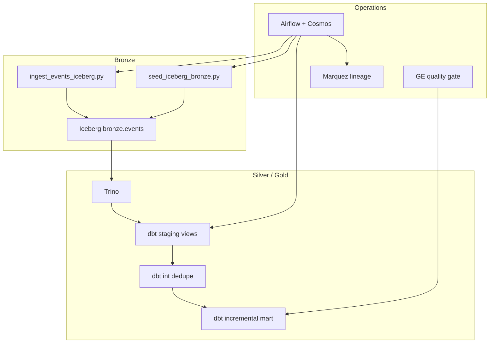

# Interview Architecture Walkthrough

> **See also:** [README](../README.md) · [ARCHITECTURE.md](../ARCHITECTURE.md) · [ADRs](./decisions/)

Use this doc to rehearse a 5–10 minute portfolio walkthrough for senior data engineer interviews.

## 30-second pitch

> "I built a production-style lakehouse reference platform: PyIceberg lands events in Iceberg bronze on MinIO, Trino queries the REST catalog, dbt transforms through staging → intermediate → incremental marts, Airflow + Cosmos orchestrates per-model tasks, OpenLineage feeds Marquez, and Great Expectations gates publish. CI runs the full DuckDB path; Docker runs the native Iceberg + Trino path. I also have an open Airflow PR for dbt Cloud OpenLineage."

## Stack at a glance

| Layer | Tool | Why |
|-------|------|-----|
| Storage | Apache Iceberg + MinIO | Open format, time travel, engine-agnostic |
| Catalog | Iceberg REST | Vendor-neutral metadata API |
| Query | Trino | Federated SQL over Iceberg without Spark cluster |
| Transform | dbt (duckdb / trino) | Tests, docs, incremental logic in SQL |
| Orchestration | Airflow 3 + Cosmos | Thin DAG; dbt owns business logic |
| Lineage | OpenLineage → Marquez | Cross-tool parent/child runs |
| Quality | dbt tests + GE checkpoint | Fail-fast before mart publish |
| IaC | Terraform | Bronze S3 bucket + pipeline IAM |

## Data flow (native Iceberg path)



## Medallion layers (what to say)

1. **Bronze** — Raw events in Iceberg, append-only, schema enforced at write time via PyIceberg.
2. **Staging** — Type casting, `event_date` partition key, source freshness tests.
3. **Intermediate** — Window dedup (`row_number` by `event_id`, latest wins).
4. **Marts** — `fct_daily_events` incremental with `delete+insert` on `(event_date, event_type)` for backfill safety.

## Design decisions (link to ADRs)

| Decision | Choice | Rationale |
|----------|--------|-----------|
| Table format | Iceberg over Delta | Engine-neutral; avoids vendor lock-in ([ADR-001](./decisions/001-iceberg-over-delta.md)) |
| Orchestration | Thin Airflow + dbt | SQL in dbt, not Python in DAGs ([ADR-002](./decisions/002-thin-orchestration.md)) |
| Lineage | OpenLineage contract | dbt Cloud jobs as RUN-level parents ([ADR-003](./decisions/003-openlineage-as-contract.md)) |
| Local dev | DuckDB target | Fast CI; no Docker required |
| Docker demo | Trino + Iceberg target | Shows real lakehouse query path |

## Demo script (5 minutes)

### Fast path (no Docker) — for screen-share reliability

```bash
pip install -r requirements.txt
make pipeline          # ingest → dbt build → GE gate
make docs              # optional: show dbt docs site
```

Point out: 14 dbt tests, incremental mart, GE publish gate.

### Full path (Docker) — for "real lakehouse" questions

```bash
docker compose up -d
# Wait for Trino healthy (~60s)
# Airflow :8080 → trigger lakehouse_daily
# Marquez :5000 → show lineage graph
# Trino :8090 → SELECT * FROM iceberg.marts.fct_daily_events
```

Say explicitly: **"Docker uses DBT_TARGET=iceberg — dbt-trino writes marts back to Iceberg; no DuckDB bridge."**

## Common interview questions

### Why Iceberg instead of Delta?

Iceberg's REST catalog and multi-engine support (Trino, Spark, Flink) fit platform teams that won't standardize on one vendor. Delta is excellent inside Databricks; I'd choose Delta when the org is Databricks-native.

### Why Cosmos instead of BashOperator for dbt?

Cosmos parses the dbt manifest into per-model Airflow tasks — retries, SLA, and lineage are model-granular. BashOperator is fine for prototypes; Cosmos is what I'd use in production.

### How do you handle backfills?

- DAG: `catchup=False`, `max_active_runs=1`
- Mart: incremental `delete+insert` keyed on `event_date`
- Runbook: [backfill-safety.md](./runbooks/backfill-safety.md) — confirm idempotency, run dbt with `--full-refresh` only when intended

### What happens when quality fails?

GE checkpoint runs after dbt build. Failure blocks `publish_marts` downstream. dbt tests catch schema/logic issues earlier in the Cosmos task group; GE validates the mart DataFrame before consumers see it.

### How would this scale to prod?

| Local | Production |
|-------|------------|
| MinIO | S3 |
| Iceberg REST fixture | Tabular / Polaris / AWS S3 Tables |
| Trino in Docker | EMR/Starburst/Databricks SQL |
| Airflow standalone | MWAA / Composer / Astronomer |
| Terraform module | Full env workspaces (dev/staging/prod) |

### Tell me about your OSS work

Open PR [**apache/airflow#70185**](https://github.com/apache/airflow/pull/70185): attaches dbt Cloud job metadata (`job_id`, `run_id`, `account_id`) to Airflow OpenLineage events — short-term fix for [#68661](https://github.com/apache/airflow/issues/68661) until OpenLineage RUN-level spec lands.

## Artifacts to show reviewers

| Artifact | URL |
|----------|-----|
| Repo | https://github.com/br413/lakehouse-platform-starter |
| dbt docs (hosted) | https://br413.github.io/lakehouse-platform-starter/ |
| CI badge | GitHub Actions — dbt build, smoke test, terraform validate |
| OpenLineage PR | https://github.com/apache/airflow/pull/70185 |

## Trade-offs I'd acknowledge proactively

- **DuckDB vs Trino**: Two targets add complexity; justified for fast CI vs credible lakehouse demo.
- **GE on pandas**: Reads mart into memory; at scale, use GE with Spark/Trino or dbt tests only.
- **Iceberg init in Docker**: PyIceberg seed/ingest scripts, not Meltano — deliberate scope cut; Meltano is the next increment.
